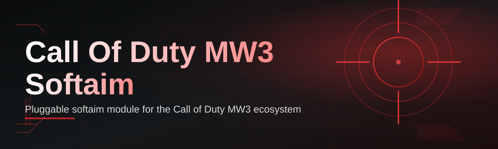

# mw3-aim-assistant 🎯🕹️

  

| Requirement | Minimum |
|---|---|
| OS | Windows 10 / 11 (64-bit) |
| Type | Standalone `.exe`, no installer |
| Dependencies | None — self-contained runtime |
| Admin rights | Recommended for input-level access |

*A precision layer for Call of Duty MW3 — tuned assist, zero bloat, built for people who read changelogs.*

  

---

## 🆚 mw3-aim-assistant vs. The Rest of the Field

**TL;DR:** most MW3 softaim tools are either bloated overlays or abandoned scripts — this one is maintained, lightweight, and documented like a real product.

| | **mw3-aim-assistant** | Generic Aim Scripts | Manual Sensitivity Tools |
|---|---|---|---|
| Setup time | Under 2 minutes | 15+ minutes, config hunting | N/A — no assist logic |
| Update cadence | Tracked against MW3 patches | Sporadic, often stale | N/A |
| Interface | Clean overlay + hotkeys | Config files, no UI | OS-level sliders only |
| Resource footprint | Lightweight, single process | Varies, often heavy | Minimal |
| Per-weapon tuning | Yes, saved profiles | Rare | No |
| Community support | Active issues + Discord | Usually dead repos | N/A |

> Every row above is a design decision, not a marketing line. The rest of this document explains why.

---

## 🎯 Overview

**TL;DR:** mw3-aim-assistant is a Windows-native assist layer for MW3 that smooths, prioritizes, and stabilizes target tracking without touching game files.

Call of Duty MW3 rewards fast decision-making more than raw mechanical perfection — target prioritization under pressure, recoil compensation across a dozen weapon archetypes, and micro-adjustments during peek exchanges are where most players actually lose engagements. **mw3-aim-assistant** exists to close that gap. It sits between your input device and the game as a lightweight assist layer, reading screen data and adjusting cursor behavior in real time so tracking feels natural instead of robotic.

This project was built for players who want configurable, transparent assist behavior instead of a black-box binary. Every parameter — FOV radius, smoothing curve, target switch delay — is exposed and saveable per weapon. It's aimed at casual players climbing ranked lobbies, controller-on-PC users fighting input disparity, and tinkerers who enjoy reading how detection pipelines are structured.

Unlike scripts pieced together from forum threads, this repository is versioned, documented, and updated against MW3 patch cycles. No hidden telemetry, no obfuscated binaries — just a tool you can inspect, configure, and reason about.

---

## ⚙️ What It Actually Does

**TL;DR:** eight core capabilities, each solving one specific MW3 aiming problem — no filler features.

- **Adaptive Target Tracking** — locks onto the nearest valid target inside your configured FOV and re-evaluates every frame instead of sticking rigidly to a single point.

- **Recoil-Aware Smoothing** — applies a decay curve that compensates for weapon-